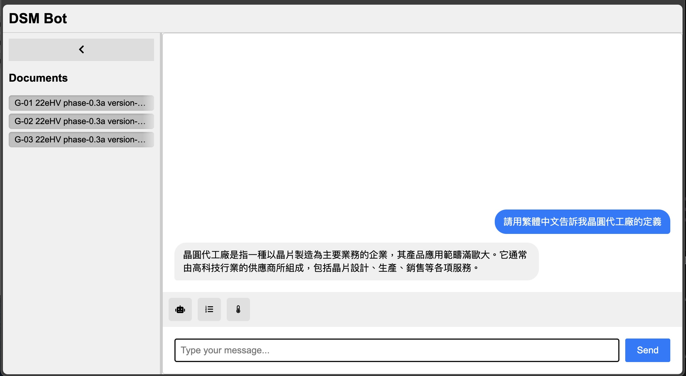

# DSM Bot


# Tech Stacks
1. 後端框架: FastAPI
2. 程式語言: Python
3. 向量資料庫: Chroma DB
4. Embedded Model: Sentence Transformers
5. 語言模型: Mistral
6. PDF 處理: PyPDF2
7. 依賴注入: FastAPI Depends

# Hierarchy
```
project_root/
│
├── src/
│   ├── api/
│   │
│   ├── database/
│   │   └── vector_store.py               # 管理向量資料庫的操作
│   │
│   ├── models/
│   │   └── 
│   │
│   ├── services/
│   │   ├── llm_service.py                # 定義和初始化語言模型 (Ollama)
│   │   ├── chat_service.py               # 處理聊天邏輯，整合向量資料庫與語言模型
│   │   └── document_service.py           # 處理向量數據庫操作
│   │
│   └── utils/
│       └── pdf_loader.py                 # 處理 PDF 文章的加載和文本提曲
│
├── docs/
│   └── [PDF files]
│
├── contracts/
│   ├── chat_request.py
│   ├── chat_response.py
│   └── document_load_response.py
│
├── web/
│   ├── index.html                       # 主頁面 HTML 文件
│   ├── script.js                        # 處理前端邏輯的 JavaScript 文件
│   └── style.css                        # 定義前端樣式的 CSS 文件
│
├── data/
│
├── scripts/
│   └── chat.http
│
├── tests/
│
├── main.py
├── README.md
├── config.py                         # App 的設置, 如預設的 model, pdf 路徑, chunk 
└── requirements.txt
```

# Packages
1. 嵌入模型：Sentence Transformers（"all-MiniLM-L6-v2"）
2. 語言模型：Ollama（Mistral）
3. Chroma DB：用於向量儲存和相似性搜索
4. PyPDF2：用於 PDF 文件處理
5. LangChain：用於整合各種 NLP 組件
6. FastAPI：Web API 框架
7. Pydantic：數據驗證和設置管理